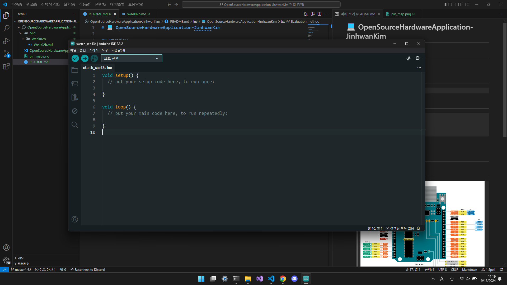
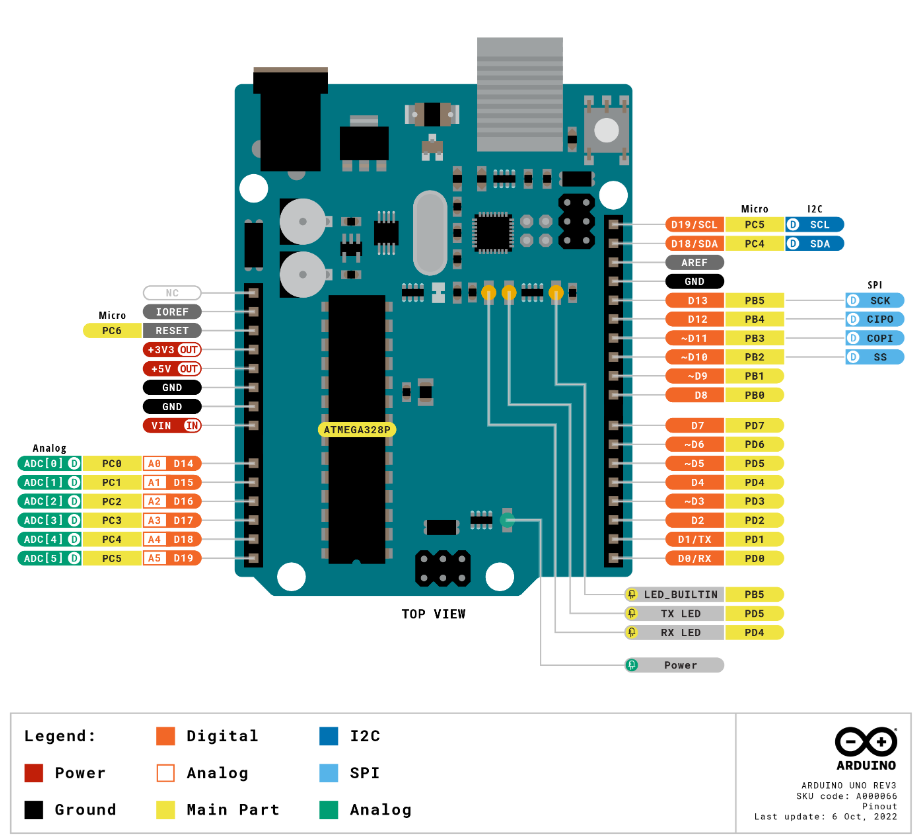

# 💻 OpenSourceHardwareApplication-JinhwanKim

## Preview

## Introduction

> 2024년 2학기 오픈소스하드웨어응용[01]

## Evaluation method

> 중간 ?%  
> 기말 ?%  
> 프로젝트 ?%  
> 출석 ?%  

- 아두이노 사용

## Note

- ## Arduino UNO pin map

    > 
